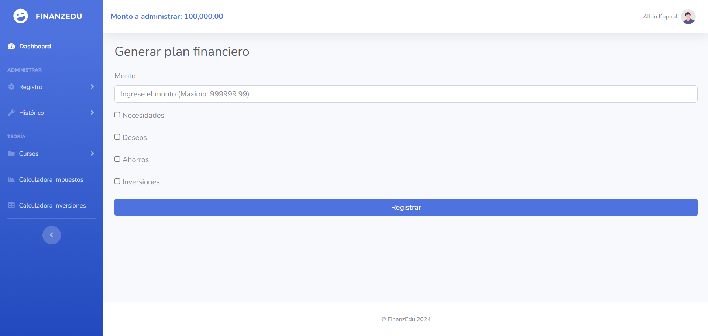
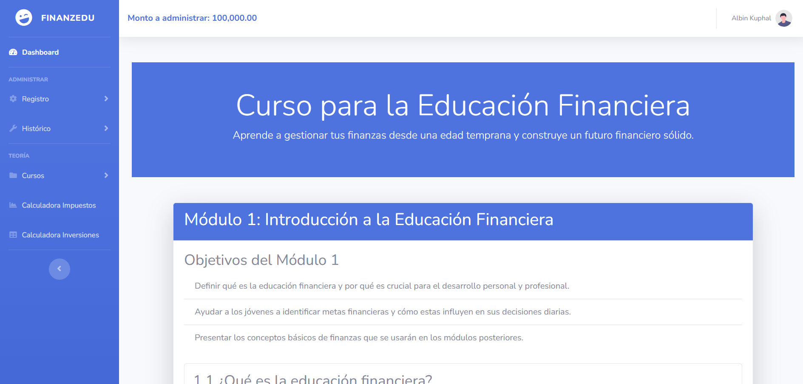
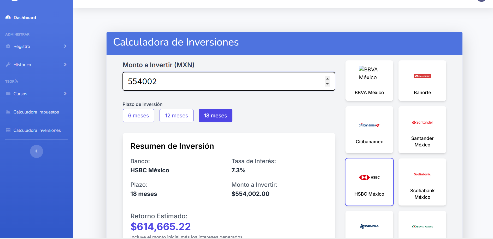
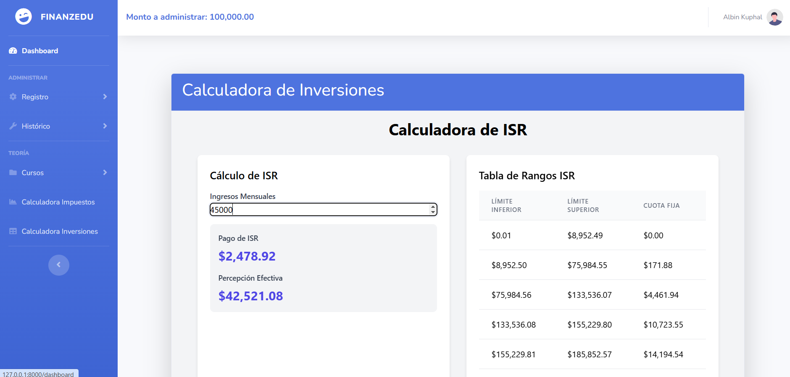

# 📊 FinanzEdu  

  
*Interfaz inicial de FinanzEdu*

**FinanzEdu** es un proyecto diseñado para facilitar el **aprendizaje y la administración de finanzas personales**. Este software busca ser una herramienta educativa y práctica para quienes desean mejorar su manejo del dinero de manera efectiva y consciente.

---

## 🧑‍🤝‍🧑 Acerca de nosotros  

  
*Nuestro equipo trabaja con pasión para ayudarte a alcanzar tus metas financieras.*

En **FinanzEdu**, creemos que todos tienen el derecho de aprender a manejar sus finanzas de manera eficiente. Nuestro objetivo es ofrecer herramientas accesibles y educativas que transformen la forma en que administras tu dinero.  

---

## 💡 Ventajas de usar FinanzEdu  

  
*Gráficos, educación y simulaciones personalizadas: todo en un solo lugar.*

1. **Aprendizaje práctico**: Todo está diseñado para que comprendas tus finanzas en tiempo real.  
2. **Adaptado a ti**: Herramientas personalizables según tus necesidades y objetivos.  
3. **Resultados claros**: Gráficos y reportes que hacen todo más visual y fácil de entender.  
4. **Portabilidad**: Usa FinanzEdu en cualquier lugar, desde tu computadora o dispositivo móvil.  

---
---

## 📊 Dashboard  

  
*Visualiza tu progreso financiero de forma clara e intuitiva.*

---
---

## 🛠️ Funcionalidades  

### ➕ Registro de ingresos  
  
*Registra tus ingresos fácilmente a través de un formulario intuitivo.*  

### ➖ Registro de gastos  
  
*Controla tus gastos con un sistema claro y organizado.*  

---
### 📜 Histórico de gastos e ingresos  
  
*Consulta tus registros anteriores para un mejor control y planificación.*  

---
### 📝 Generación de planes financieros  

Selecciona las categorías que prefieras, y FinanzEdu distribuirá automáticamente tu monto de la mejor manera posible.  

  
*Optimiza tu presupuesto según tus necesidades y prioridades.*  

---
### 📚 Cursos de finanzas  

Aprende sobre finanzas desde cero con cursos diseñados para enseñarte conceptos básicos, estrategias avanzadas y todo lo que necesitas para mejorar tu manejo del dinero.  

  
*Educación accesible para todos, desde principiantes hasta expertos.*  

---
### 💹 Calculadora de inversiones bancarias  

Simula tus inversiones eligiendo entre las siguientes opciones:  
1. **Plazo**: Define la duración de tu inversión según tus objetivos.  
2. **Banco**: Escoge entre distintas entidades bancarias para comparar rendimientos.  
3. **Monto**: Ingresa el capital que planeas invertir para obtener resultados personalizados.  

  
*Explora tus opciones de inversión de manera fácil y rápida.*  

---
### 🧮 Calculadora de ISR  

Calcula el **Impuesto Sobre la Renta (ISR)** de un monto determinado de manera rápida y precisa. Solo ingresa tu monto y FinanzEdu hará los cálculos por ti.  

  
*Determina el ISR correspondiente de acuerdo con tu ingreso.*  

---
---
### ⚙️ Requisitos y despliegue  

Este proyecto está desarrollado con **Laravel**. Para ejecutarlo correctamente, necesitas tener instalada una versión reciente de **PHP**.

#### Pasos para desplegarlo:
1. Clona el repositorio a tu máquina local.
2. Instala las dependencias de Laravel ejecutando:  
   ```bash
   composer install
   ```
    ```bash
    php artisan serve
    ```


