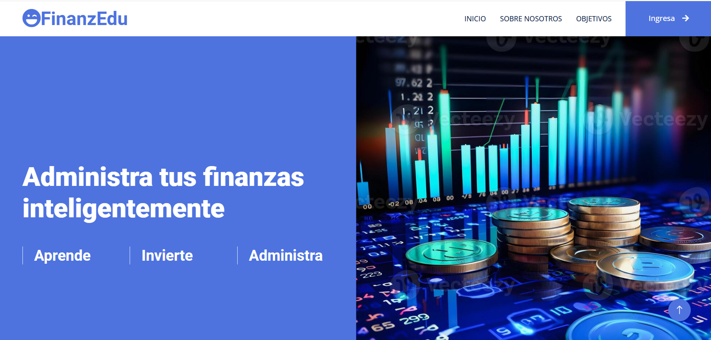
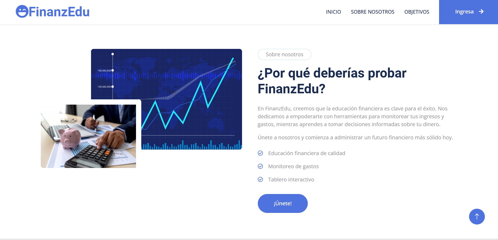
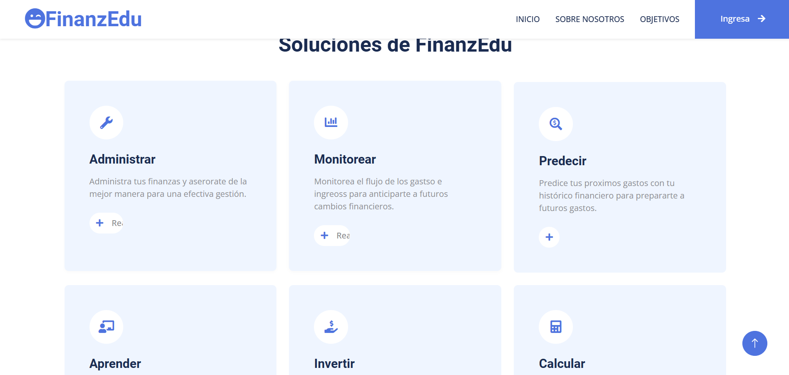
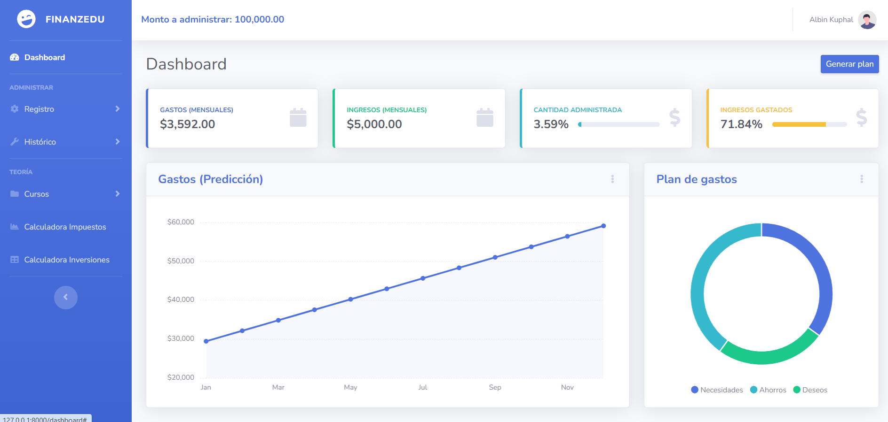
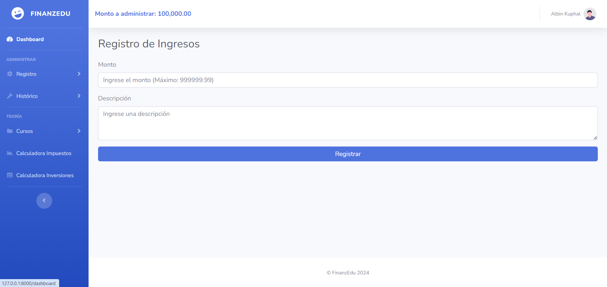
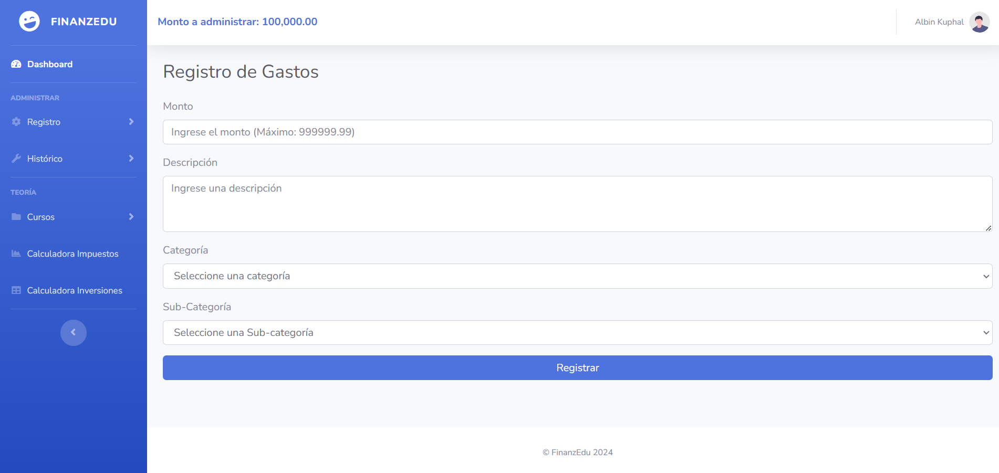
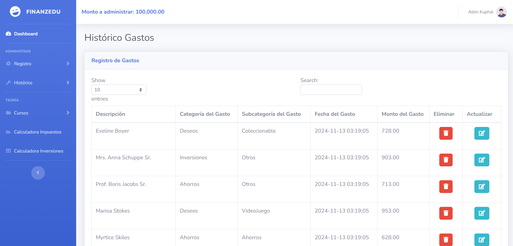

# 📊 FinanzEdu  

  
*Interfaz inicial de FinanzEdu*

**FinanzEdu** es un proyecto diseñado para facilitar el **aprendizaje y la administración de finanzas personales**. Este software busca ser una herramienta educativa y práctica para quienes desean mejorar su manejo del dinero de manera efectiva y consciente.

---

## 🧑‍🤝‍🧑 Acerca de nosotros  

  
*Nuestro equipo trabaja con pasión para ayudarte a alcanzar tus metas financieras.*

En **FinanzEdu**, creemos que todos tienen el derecho de aprender a manejar sus finanzas de manera eficiente. Nuestro objetivo es ofrecer herramientas accesibles y educativas que transformen la forma en que administras tu dinero.  

---

## 💡 Ventajas de usar FinanzEdu  

  
*Gráficos, educación y simulaciones personalizadas: todo en un solo lugar.*

1. **Aprendizaje práctico**: Todo está diseñado para que comprendas tus finanzas en tiempo real.  
2. **Adaptado a ti**: Herramientas personalizables según tus necesidades y objetivos.  
3. **Resultados claros**: Gráficos y reportes que hacen todo más visual y fácil de entender.  
4. **Portabilidad**: Usa FinanzEdu en cualquier lugar, desde tu computadora o dispositivo móvil.  

---
---

## 📊 Dashboard  

  
*Visualiza tu progreso financiero de forma clara e intuitiva.*

---
---

## 🛠️ Funcionalidades  

### ➕ Registro de ingresos  
  
*Registra tus ingresos fácilmente a través de un formulario intuitivo.*  

### ➖ Registro de gastos  
  
*Controla tus gastos con un sistema claro y organizado.*  

---
### 📜 Histórico de gastos e ingresos  
  
*Consulta tus registros anteriores para un mejor control y planificación.*  

